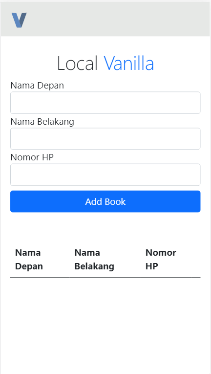

## Localstorage VanillaJS

### About 
This Application was developed using ```vanilla Javascript``` and ```localstorage```

### Getting Started
To getting started just clone using command ```git clone https://github.com/ivandi1980/local-vanilla.git```
    
    Note : if you're using VSCode, you can install ```live-server``` plugin to run this app smoothly


### ScreenShoot
Here are the Screenshoot of this application

